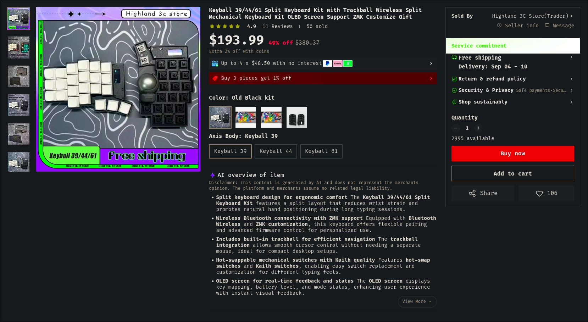
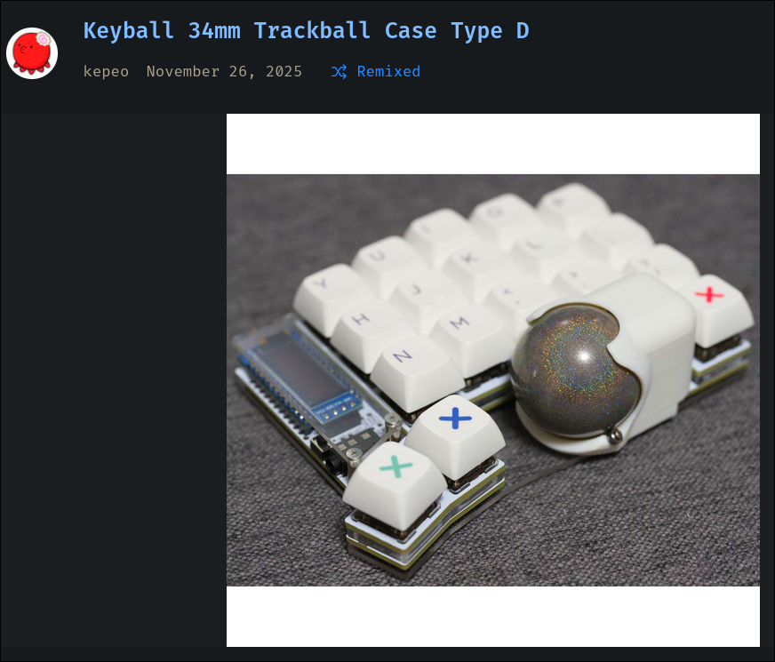
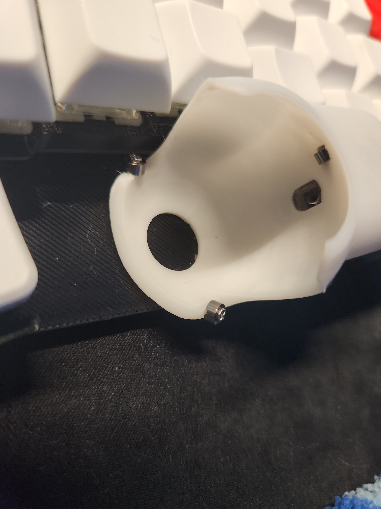
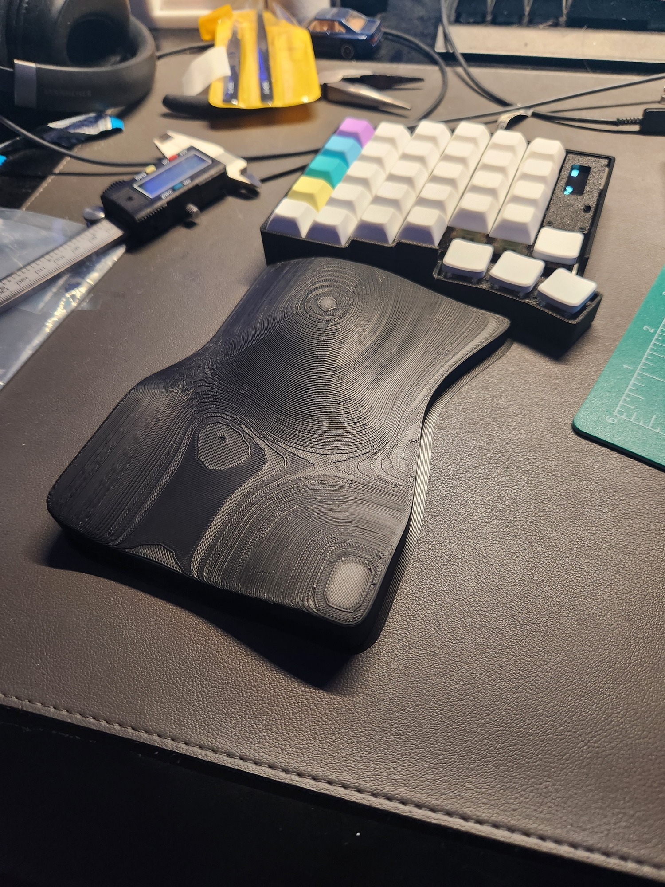
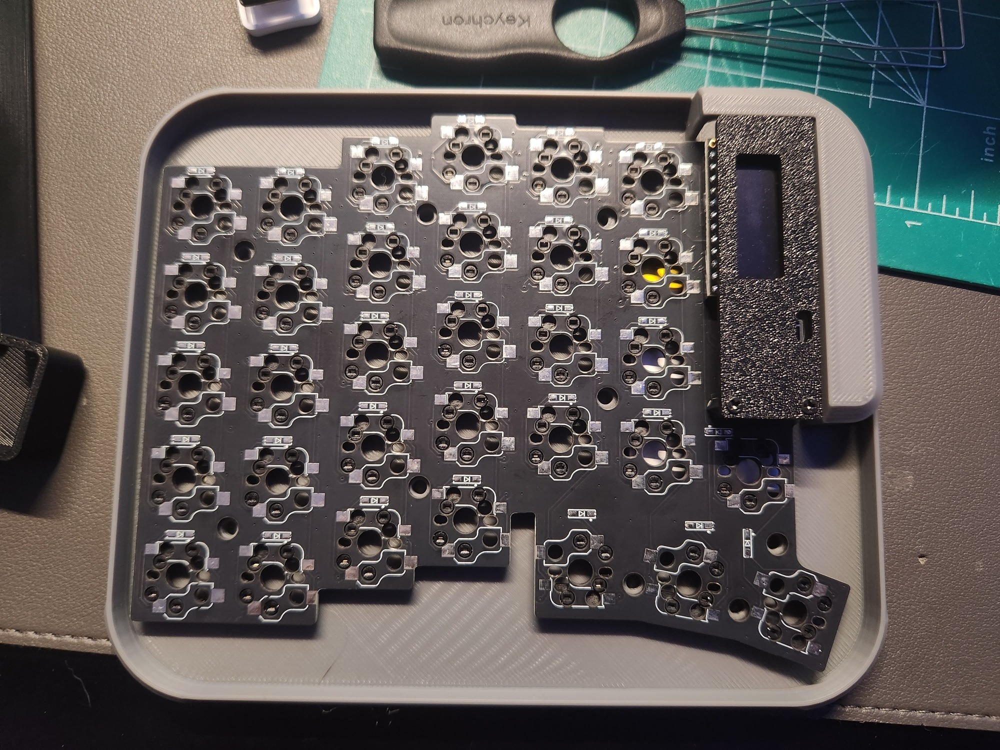

# KEYBALL61 Build Journal

--- WORK IN PROGRESS ---

### July 21, 2026
Received Keyball61 from Aliexpress

Gateron Baby Kangaroos and XDA keycaps

### July 26, 2026
Printed a new ballsack model design by kepeo on [thingiverse](https://www.thingiverse.com/thing:7213239)

This ballsack uses 3 regular bearings instead of the static balls that came on the one from aliexpress.

Around this time I realized the stl files the aliexpress seller sent me didn't fit the actual PCB.  The screw holes had been shifted slightly various directions.  I started to redesign the case in blender, knowing I wanted to incorporate a palm rest of some sort eventually which blender would be perfect for.

My initial 1st pass for a palm rest was *slightly* too big, but the form was actually working rather well.

### July 27, 2026
Made some revisions to my ergopad model and printed a revision 2.
- Shorter length
- Palm bump taller, more aggressive angle
- Wrist area could be tighter, want to try a cradle feel to help locate the wrist in the right position.

Also printed out my first slim case design, trying to get the correct screw boss locations.  This was a failure, you can sort of see how offcenter some of them are in the picture.

There was also another revision of the ergopad later that day, but such minor changes not really worth a description.

### July 28, 2026
