# KEYBALL61 Build Journal

--- WORK IN PROGRESS ---

### July 21, 2026
Received Keyball61 from Aliexpress

[Link to listing](https://www.aliexpress.us/item/3256809119391153.html)

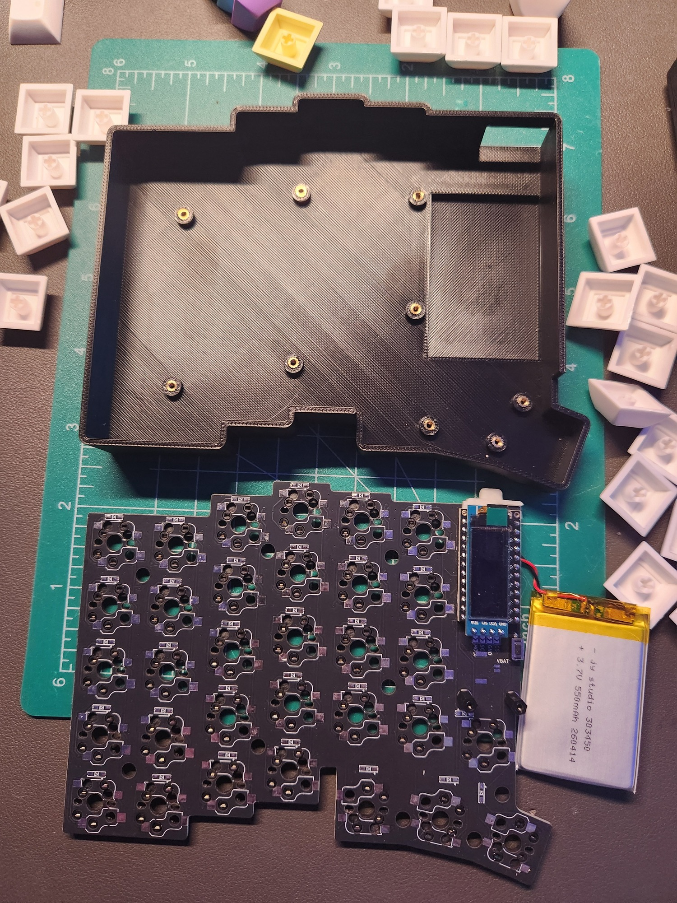 
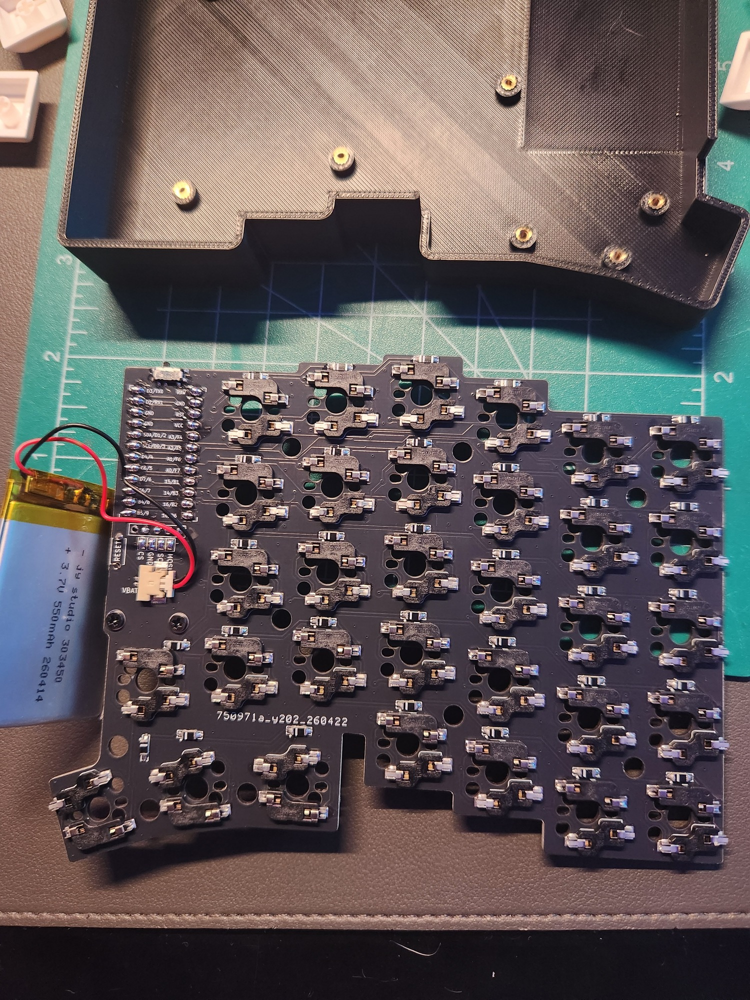

Gateron Baby Kangaroos and XDA keycaps
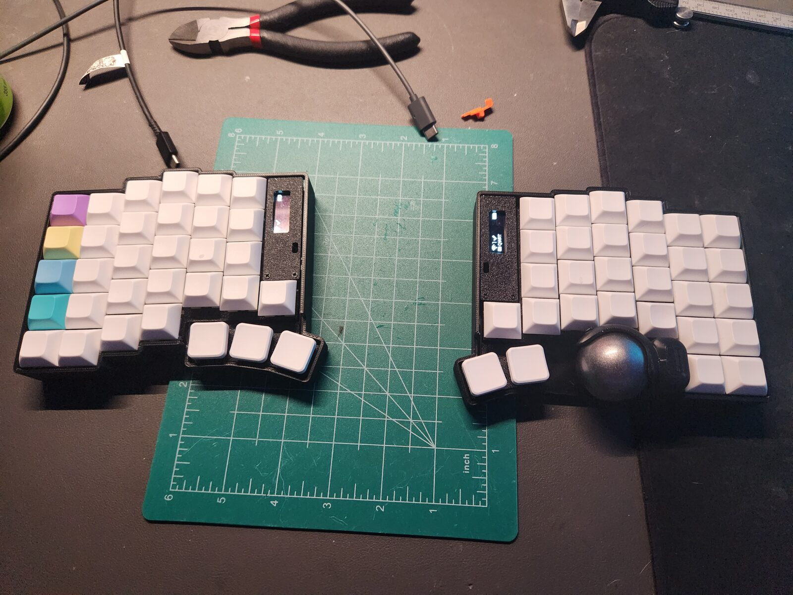

### July 26, 2026
Printed a new ballsack model design by kepeo on [thingiverse](https://www.thingiverse.com/thing:7213239)

This ballsack uses 3 regular bearings instead of the static balls that came on the one from aliexpress.

Around this time I realized the stl files the aliexpress seller sent me didn't fit the actual PCB.  The screw holes had been shifted slightly various directions.  I started to redesign the case in blender, knowing I wanted to incorporate a palm rest of some sort eventually which blender would be perfect for.

My initial 1st pass for a palm rest was *slightly* too big, but the form was actually working rather well.

### July 27, 2026
Made some revisions to my ergopad model and printed a revision 2.
- Shorter length
- Palm bump taller, more aggressive angle
- Wrist area could be tighter, want to try a cradle feel to help locate the wrist in the right position.
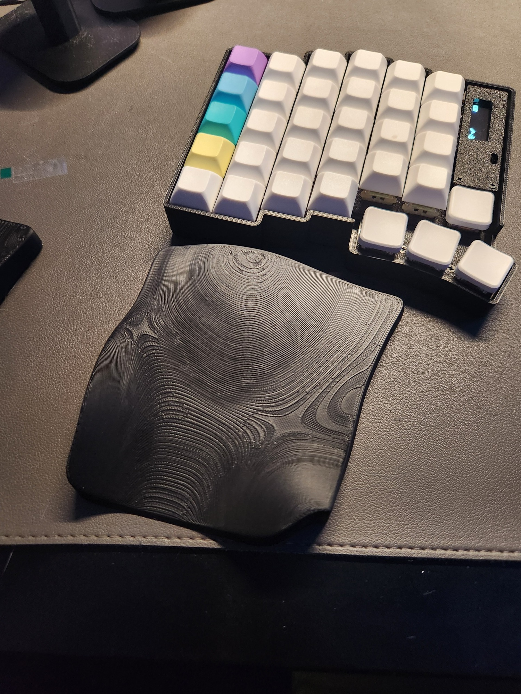

Also printed out my first slim case design, trying to get the correct screw boss locations.  This was a failure, you can sort of see how offcenter some of them are in the picture.

There was also another revision of the ergopad later that day, but such minor changes not really worth a description.

### July 28, 2026
Got the slim case with the correct boss locations all fit up with a matching keyplate.
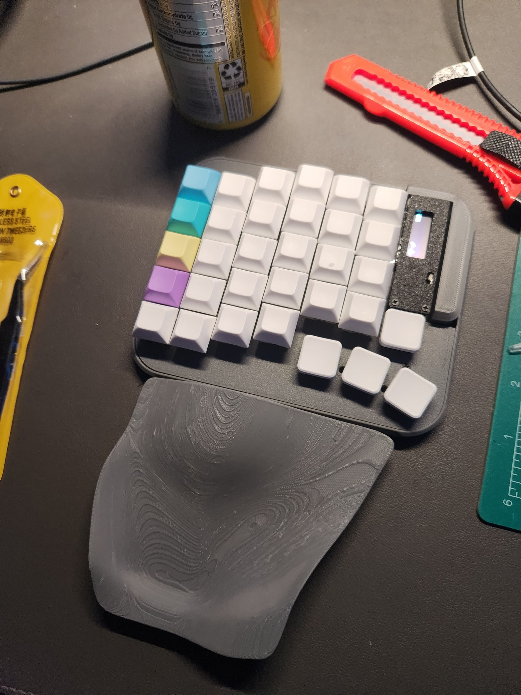

This was really just a way to quickly print out the bottom shell with screw bosses so I knew I had the positions right, I knew the intent was to eventually build a case with the ergopad built in.  But it was a great starting off point, and felt good to get it all put together finally.

Also had another iteration of the ergopad, built a bit of a cradle for my wrists - it was slightly too aggressive, but I printed both sides to get a feel for it with the trackball and make sure it didn't feel funky.
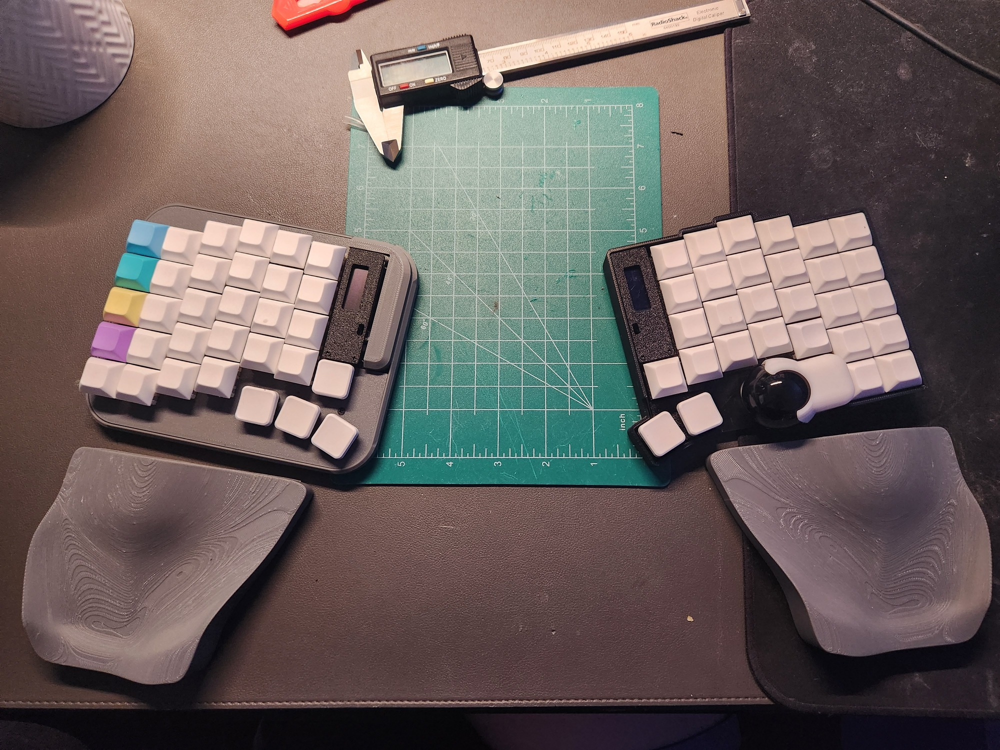

### August 3, 2026

Spent some time building out the integrated case design with the new screw hole locations and keyplate setup.  It was relatively easy since I already had a rough version of the ergopad that I knew worked, I just mapped out where it felt most natural on the slim case and placed it as close as I could to that location in blender.  Used simple booleans to merge it together for the first prototype prints.
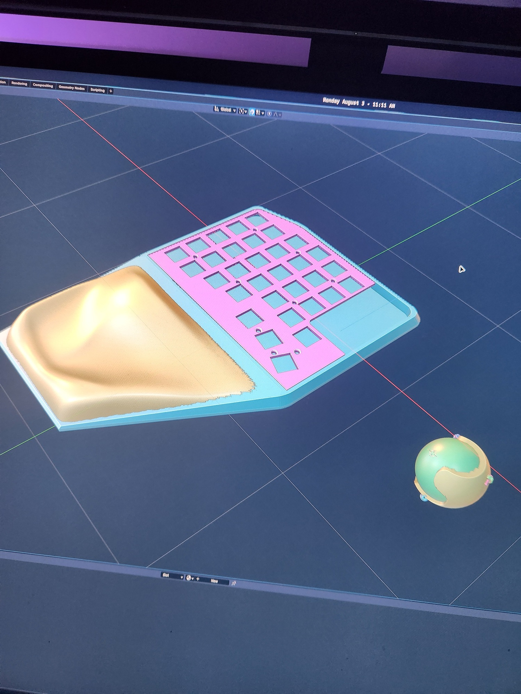
*I want to apologize for the pictures of the screen, instead of proper screenshots...I will be better about taking actual screenshots when working on this in the future lol*

Printed out the left side proof of concept, just used black PLA on the first 30 layers or so to give it a 2-part look.
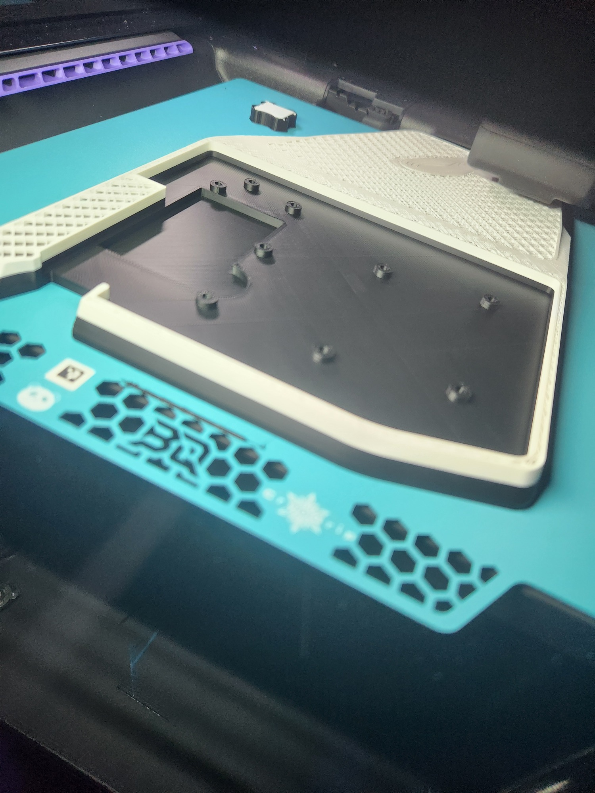

Had to wait on more choc browns, but put it together with the gaterons in the top row as a temporary solution.
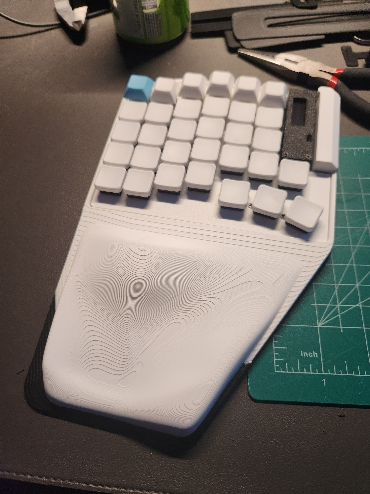

### August 4, 2026

Now I finally had the first prototype made, but I had been putting off the entire right side this whole time...so that was next on the list.  Thankfully because of the issues I ran into with the screwbosses on the left half, I was expecting the same to happen so I printed out a few slim boards to get the locations nailed down.

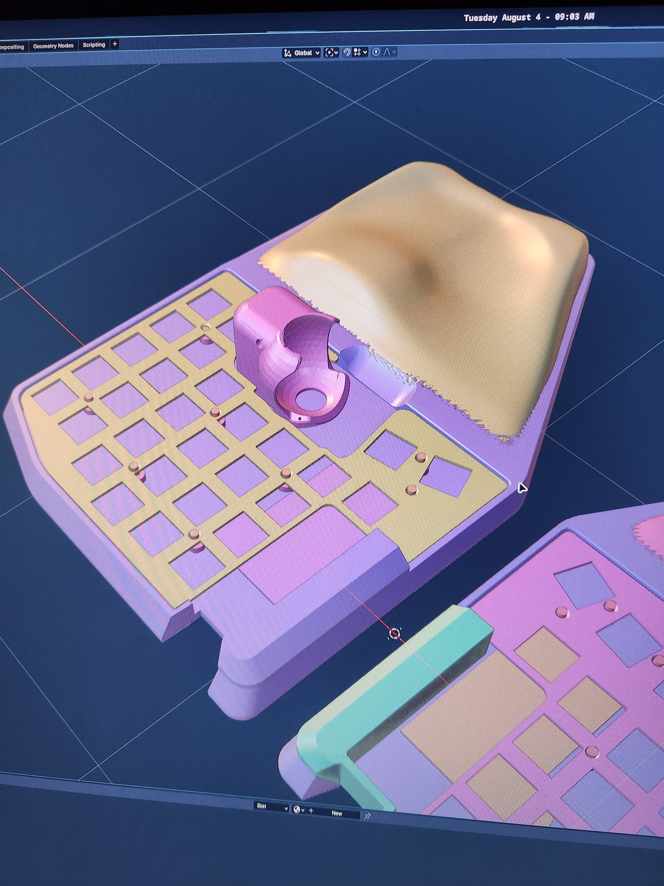

I only took a couple pictures of the right side, mainly of the trackball sensor because I had been curious how that was put together...but here they are for future reference.

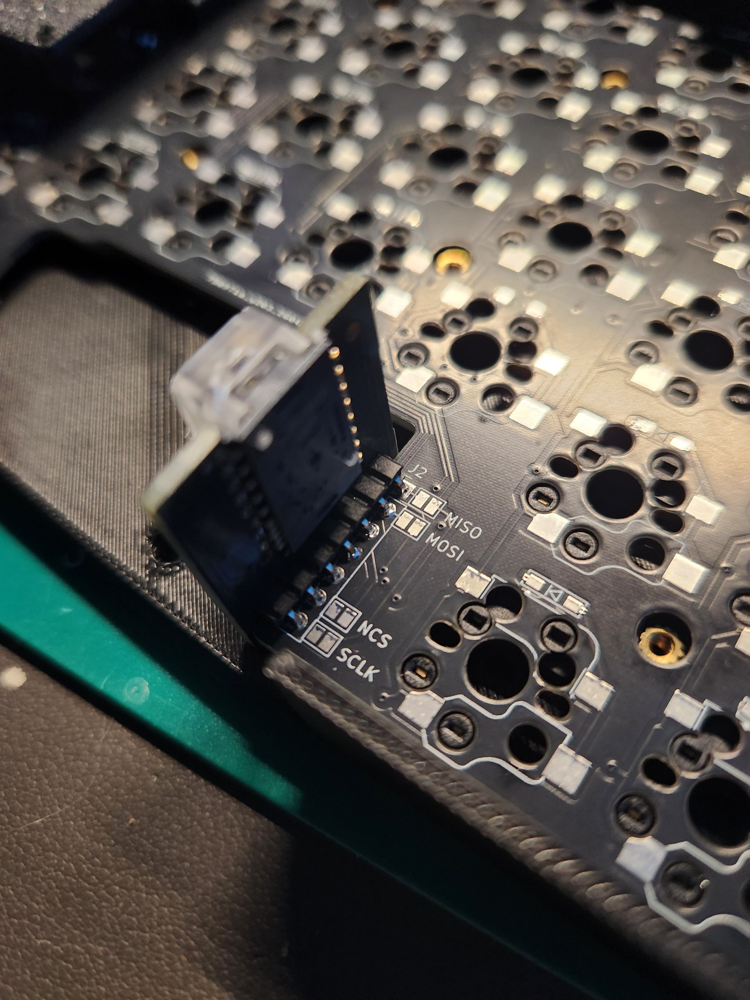
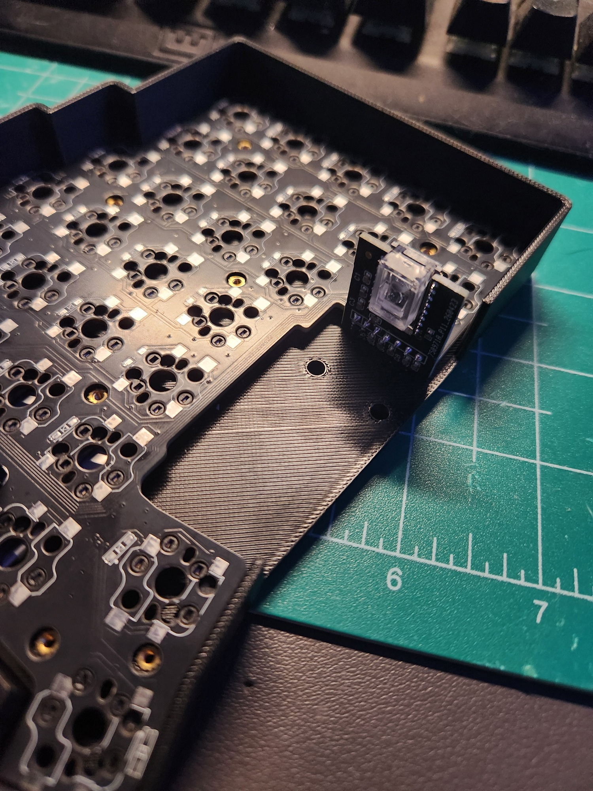

And here is the right side all printed, was still waiting on the chocs

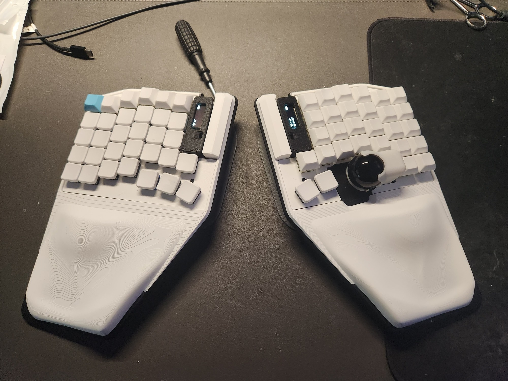

### August 6, 2026

Chocs came in
.jpeg)
.jpg)
.jpg)

### NEXT STEPS
- refine the palm rest form, bring palm bump up closer to the keys
- shorten overall palm rest area
- fix screen cover piece, integrate it into the case itself instead of the standoffs on the board
- add better switches for on/off and reset button
- look into other keyball pcbs, how hard would it be to make versions for 39 and 44?
